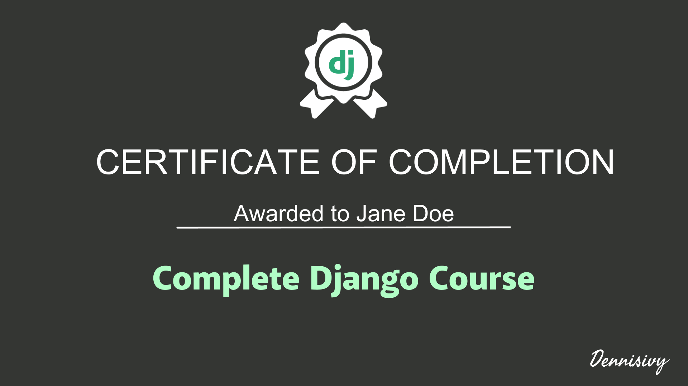

Congratulations 🥳
If you're here, you've probably just succesfully completed and passed The Complete Django Course!

## Accessing your certificate
1. 🗂️ Find the folder with your name on it 
2. ⬇️ Open the file attached to your name and right click on the certificate to save
3. 🤨 Can't find your certificate? It may take up to 48 hours to proccess your completion and upload your certiticate. Check back in soon! 

## The Complete Django Course 
Curious about the course? We have it available on [Udemy](https://www.udemy.com/course/python-django-2021-complete-course/?couponCode=LEADERSALE24B) and [Teachable](https://dennisivy.teachable.com/p/django-beginners-course). 

